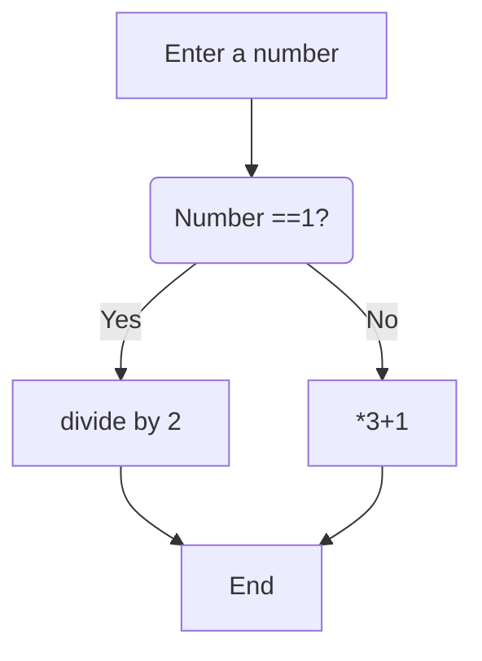

# mywork

My Work area

Input:
```python
for i in list:
    print(i)
```
Output:
```
The total in Euros and Cents is: €23.54
```

Mermaid:
https://github.blog/2022-02-14-include-diagrams-markdown-files-mermaid/


